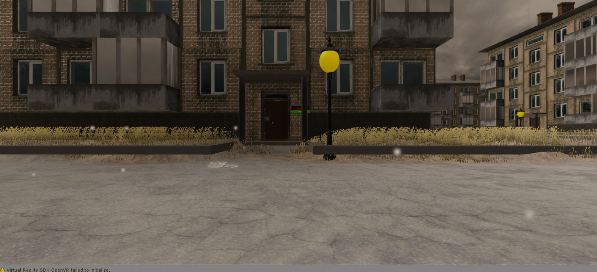
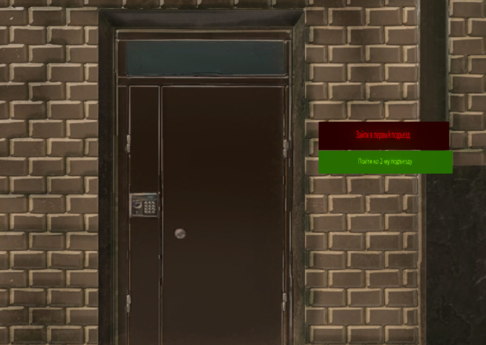
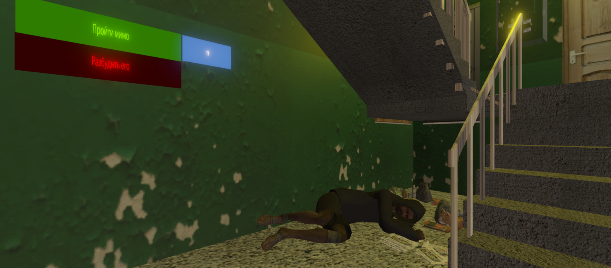
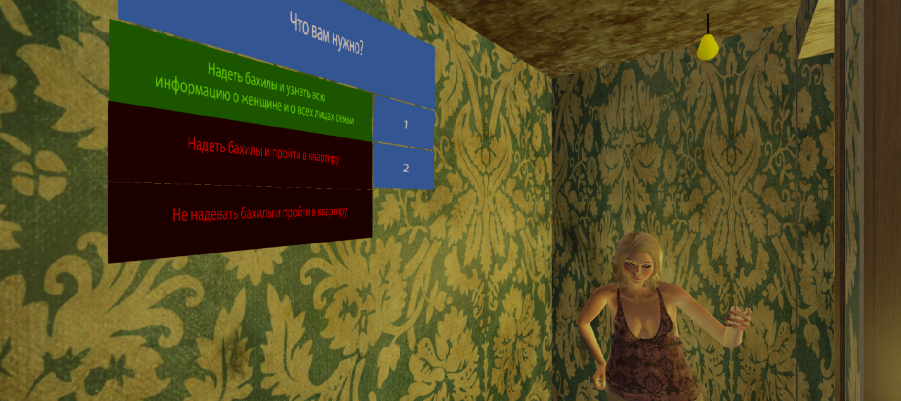
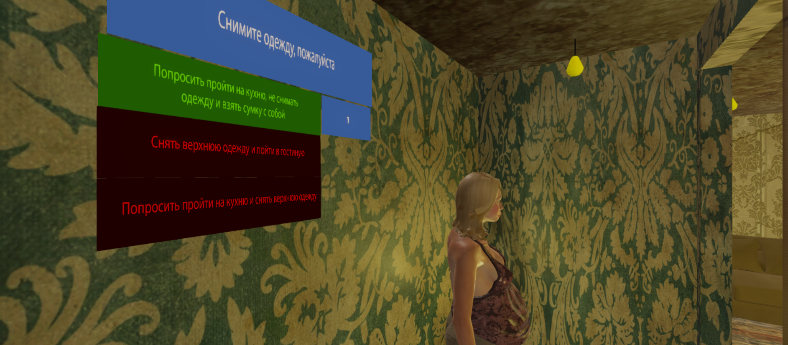
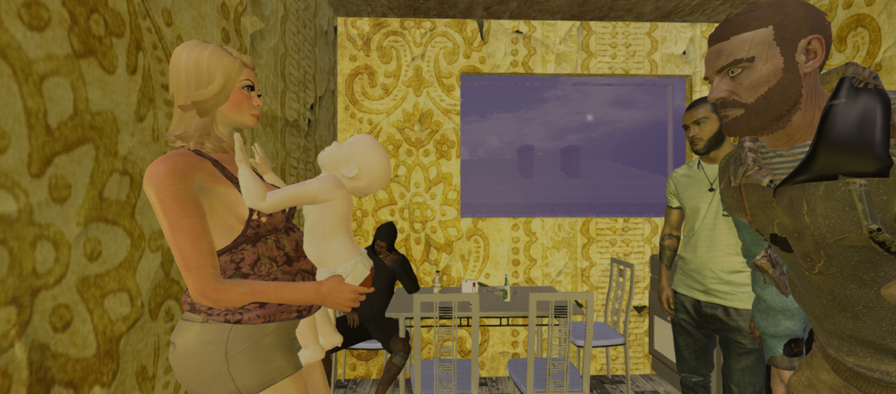

# Social Worker Simulator

VR проект для РГСУ под шлем HTC VIVE, представляющий собой симулятор для социального работнка, необходимый для их тестирования. Проект выполнен в рамках задания от компании HTC.

---

# Images

---

# Tech
* C#
* 3D modeling
* Unity 3D
---
# Developers
* Баканова М.В.
* Новаков Н.Ю.
* Лушин В.Е.
* Миронов В.Ю.
* Закревский А.Г.
---

